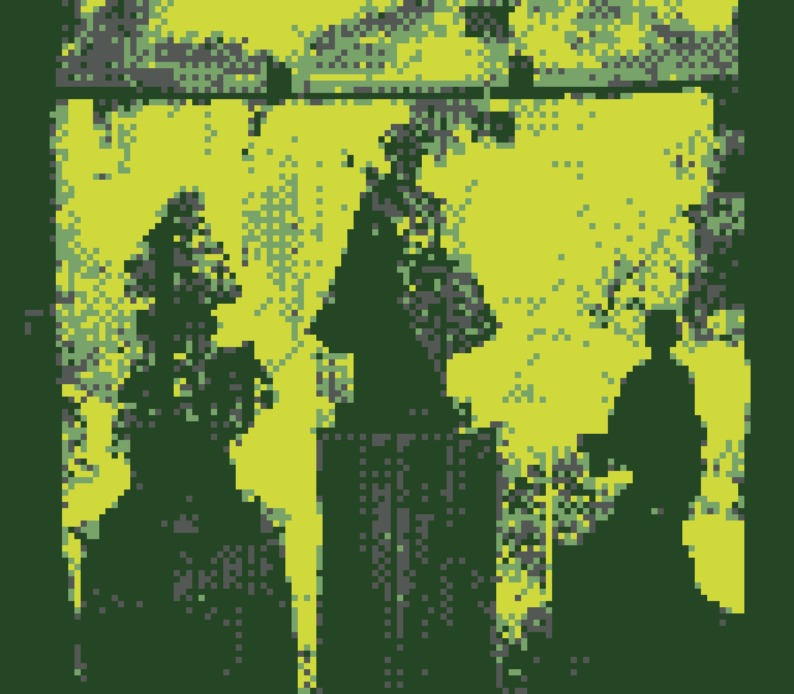

+++
image = "grotto.png"
date = "2024-08-17"
title = "grotto"
type = "gallery"
+++

Tito Garie and Tita Anna visited me last Thursday then we went to Oregon today.
We went to [*The National Sanctuary of our Sorrowful Mother* (The Grotto)](https://thegrotto.org/) and attended mass.
There were lots of Filipinos&mdash;even the priest is Pinoy!

This photo is a Filipino shrine in the upper gardens. 
Inside are three statues, from left to right: Our Lady of Dambana, Santo Nino de Cebu, and San Lorenzo Ruiz.

