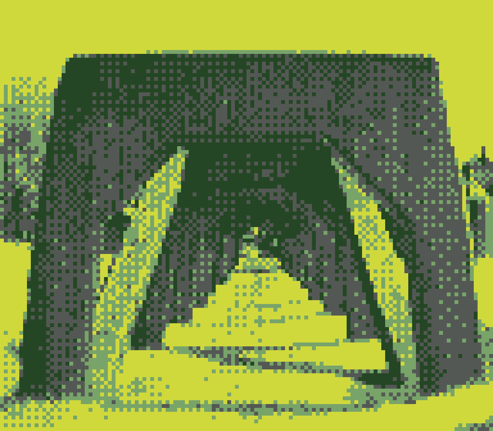

+++
image = "ananya.png"
date = "2024-04-13"
title = "photowalk"
type = "gallery"
+++

Had a nice photowalk with Ananya, a fellow pre-doc, on a sunny Saturday afternoon.
Here are some photos (from left to right):

- The underside of the Aurora Bridge
- A portion of the Burke-Gilman trail, behind the Google offices
- A sailboat passing through the Fremont cut
- Inside Fiasco, an Italian restaurant near Stoneway
- Some concrete trestles (used to support railroad carts) in Gas Works Park

